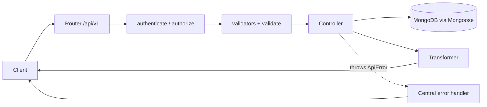
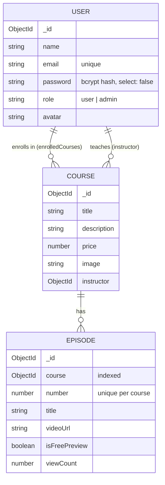

# E-Learning Platform API

[](https://github.com/Mohsen9374/elearning-platform-api/actions/workflows/ci.yml)


A RESTful backend for an online course platform in the style of Udemy: a public course catalogue, user accounts with JWT authentication, course enrollment, protected video episodes, and an admin area for content management.

> **Background:** This started in 2020 as a learning project (Express 4, Mongoose 4, callbacks). In 2026 I rewrote it on a current stack, fixed its security and logic bugs, and added tests, CI and Docker. See [Refactoring notes](#refactoring-notes) for what changed and why.

---

## Features

- **Authentication:** registration and login with bcrypt-hashed passwords and JWT (`Authorization: Bearer`)
- **Role-based access control:** `user` and `admin` roles, with the whole admin area locked down
- **Course catalogue:** pagination, case-insensitive title search and episode counts
- **Enrollment:** users enroll in courses. Paid episode video URLs are only returned to enrolled users; free-preview episodes are open to everyone.
- **Admin CRUD** for courses and episodes, including multipart image upload
- **Input validation** with express-validator. Only whitelisted fields reach the database.
- **Centralized error handling** with a consistent JSON error format and correct HTTP status codes
- **Security middleware:** Helmet, CORS, rate limiting on auth endpoints and body-size limits
- **Integration tests** (Jest and Supertest) against a real MongoDB, running in GitHub Actions
- **Docker Compose** setup for the API and MongoDB

## Tech Stack

| Layer | Technology |
|---|---|
| Runtime | Node.js 20+ |
| Framework | Express 5 |
| Database | MongoDB with Mongoose 9 |
| Auth | jsonwebtoken, bcryptjs |
| Validation | express-validator 7 |
| Uploads | Multer 2 |
| Testing | Jest, Supertest |
| DevOps | Docker, Docker Compose, GitHub Actions |

---

## Architecture

```
src/
├── app.js               # Express app (middleware, routes, error handling) — no network binding
├── server.js            # DB connection, HTTP server, graceful shutdown
├── config/              # Environment-based configuration, DB connection
├── models/              # Mongoose schemas: User, Course, Episode
├── controllers/         # Request handlers (public, user, admin/)
├── routes/v1.js         # Versioned route definitions (/api/v1)
├── middlewares/         # auth (authenticate/authorize), validate, upload, errorHandler
├── validators/          # express-validator rule sets
├── transformers/        # Map DB documents to public API responses
└── utils/ApiError.js    # Typed HTTP errors
```

### Request flow



### Data model



### Key design decisions

| Decision | Why |
|---|---|
| **`app.js` is separate from `server.js`** | Tests import the app without opening a port or depending on a running server. |
| **Virtual populate for `Course.episodes`** | The original stored episode IDs in the course *and* the course ID in each episode. Two sources of truth drift apart. Now the episode owns the relationship and the course derives it. |
| **Compound unique index `{ course, number }`** | The database guarantees that episode numbers are unique inside a course, even under concurrent requests. |
| **Transformers** | Responses are built explicitly, so fields like password hashes or `__v` never leak. There are two episode views: an *outline* (public) and a *detail* view (enrolled users). |
| **`matchedData()` whitelisting** | Only validated fields are written, which prevents mass assignment (e.g. a client sending `role: "admin"`). |
| **Express 5 async error propagation** | Controllers `throw ApiError`. Rejected promises reach the central handler instead of crashing the process. |
| **No HTML escaping on input** | Input is validated and trimmed but stored as-is. Output encoding is the client's responsibility, which keeps the stored data lossless. |
| **Versioned routes (`/api/v1`)** | Breaking changes can ship as `/api/v2` without affecting existing clients. |

---

## Getting Started

### Option A: Docker (recommended)

```bash
git clone https://github.com/Mohsen9374/elearning-platform-api.git
cd elearning-platform-api
docker compose up --build
# create an admin user (uses ADMIN_EMAIL / ADMIN_PASSWORD from docker-compose.yml)
docker compose exec api node scripts/seed-admin.js
```

The API runs at `http://localhost:3000`.

### Option B: Local Node.js

Prerequisites: Node.js 20+ and a running MongoDB instance.

```bash
npm install
cp .env.example .env        # then edit JWT_SECRET, MONGO_URI, ADMIN_*
npm run seed:admin          # creates the admin account
npm run dev                 # starts with nodemon
```

### Running the tests

Tests need a MongoDB instance. They use `MONGO_URI_TEST` (default `mongodb://127.0.0.1:27017/elearning_test`) and drop that database afterwards.

```bash
npm test
```

---

## API Reference

Base URL: `/api/v1`. Protected routes need the header `Authorization: Bearer <token>`.

### Auth
| Method | Endpoint | Access | Description |
|---|---|---|---|
| POST | `/auth/register` | Public | Create an account and return a user and token |
| POST | `/auth/login` | Public | Log in and return a user and token |

### Courses
| Method | Endpoint | Access | Description |
|---|---|---|---|
| GET | `/courses?page=1&limit=10&q=node` | Public | Paginated course list with search |
| GET | `/courses/:id` | Public | Course details with episode outline |
| POST | `/courses/:id/enroll` | User | Enroll in a course |
| GET | `/courses/:id/episodes/:episodeId` | User | Full episode with video URL (enrolled users, admins or free previews) |

### Users
| Method | Endpoint | Access | Description |
|---|---|---|---|
| GET | `/users/me` | User | Current profile with enrolled courses |
| POST | `/users/me/avatar` | User | Upload an avatar (multipart field `image`, PNG/JPEG/WEBP, max 2 MB) |

### Admin
| Method | Endpoint | Description |
|---|---|---|
| POST | `/admin/courses` | Create a course (JSON or multipart with `image`) |
| PATCH | `/admin/courses/:id` | Update a course |
| DELETE | `/admin/courses/:id` | Delete a course and its episodes |
| GET | `/admin/episodes?course=:id` | List episodes |
| GET | `/admin/episodes/:id` | Get an episode |
| POST | `/admin/episodes` | Create an episode |
| PATCH | `/admin/episodes/:id` | Update an episode |
| DELETE | `/admin/episodes/:id` | Delete an episode |

### Other
| Method | Endpoint | Description |
|---|---|---|
| GET | `/health` | Liveness and database status |

### Example

```bash
# register
curl -X POST http://localhost:3000/api/v1/auth/register \
  -H "Content-Type: application/json" \
  -d '{"name":"Jane","email":"jane@example.com","password":"secret123"}'

# list courses
curl "http://localhost:3000/api/v1/courses?q=node&limit=5"
```

### Response format

```jsonc
// success
{ "success": true, "data": { ... }, "meta": { "page": 1, "limit": 10, "total": 42, "totalPages": 5 } }

// error
{ "success": false, "message": "Validation failed",
  "errors": [{ "field": "email", "message": "A valid email is required" }] }
```

| Status | Meaning |
|---|---|
| 400 | Bad request (malformed JSON, invalid upload) |
| 401 | Missing, invalid or expired token; wrong credentials |
| 403 | Authenticated but not allowed (not an admin, not enrolled) |
| 404 | Resource not found |
| 409 | Conflict (duplicate email, duplicate episode number, already enrolled) |
| 422 | Validation failed |

---

## Refactoring notes

What changed compared with the original 2020 version:

| Area | Before | After |
|---|---|---|
| Security | JWT secret hard-coded in the source | Loaded from `.env`; the app refuses to start without it |
| Security | Admin routes had **no authentication** | `authenticate` + `authorize('admin')` on the whole admin router |
| Security | Password re-hashed on *every* save, which broke login after any profile update | Hash only when `isModified('password')` |
| Security | No rate limiting; different errors for "unknown email" and "wrong password" | Rate-limited auth; one generic message (no user enumeration) |
| Correctness | `update` endpoints wrote a hard-coded title and ignored the request body | Validated and whitelisted body fields are applied |
| Correctness | Creating an episode for a missing course crashed the server | Returns 404 |
| Correctness | `throw err` inside callbacks crashed the process | async/await with a central error handler |
| Correctness | Upload limit was 1 KB (`1024`) instead of 1 MB; filter called `cb` twice; folder used weekday (`getDay`) | 2 MB limit, correct filter, `getDate()`, random file names |
| Data model | Episode IDs duplicated in `Course.episodes` | Virtual populate with a unique `{course, number}` index |
| Data model | `price` and `number` stored as strings | Numbers with validation |
| Stack | Express 4, Mongoose 4 (`useMongoClient`), express-validator 4, callbacks | Express 5, Mongoose 9, express-validator 7, async/await |
| Quality | No tests, no `.gitignore`, no docs | 25 integration tests, CI, Docker, this README |

## Roadmap

- Payment integration (e.g. Stripe) before enrollment
- Refresh tokens and logout or token revocation
- Course reviews and ratings
- OpenAPI (Swagger) documentation
- Object storage (S3) for uploads

## License

[MIT](LICENSE) © Mohsen Amini
